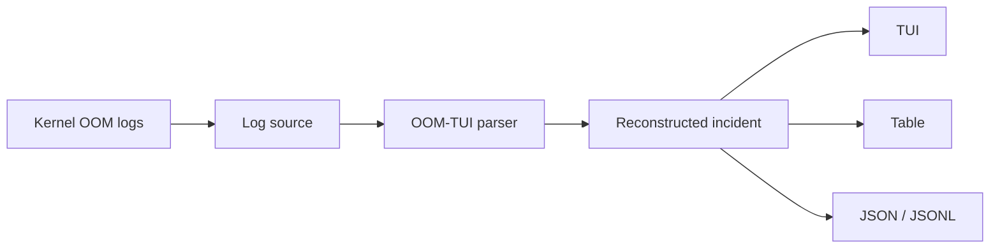

<div align="center">

# OOM-TUI

**Interactive OOM incident response for Linux.** Reconstructs scattered kernel log lines into readable incidents.

[](https://github.com/Ashfaaq98/oom-tui/actions/workflows/ci.yml)
[](https://github.com/Ashfaaq98/oom-tui/releases)
[](LICENSE)
[](#development)
[](#log-sources-and-requirements)
[](https://github.com/Ashfaaq98/oom-tui/commits/main)
[](https://github.com/Ashfaaq98/oom-tui/issues)

</div>

`oom-tui` parses Linux kernel OOM reports and reconstructs each incident from the recorded log context. It shows the terminated process, reported memory usage, cgroup scope, and other memory consumers captured at the time.



It distinguishes host-wide exhaustion from cgroup-limit kills when that context is present in the log, ranks the kernel task dump when available, and decodes common container and Kubernetes cgroup paths.

The victim is not necessarily the root cause. The task dump is a snapshot of processes recorded at the time of the kill; it can help identify memory consumers to investigate, but does not prove which process caused the pressure.

## Install

Download a static Linux binary from [GitHub Releases](https://github.com/Ashfaaq98/oom-tui/releases):

```bash
curl -L https://github.com/Ashfaaq98/oom-tui/releases/latest/download/oom-tui-x86_64-unknown-linux-musl.tar.gz | tar xz
sudo install oom-tui-*/oom-tui /usr/local/bin/oom-tui
```

Release builds target `x86_64-unknown-linux-musl` and `aarch64-unknown-linux-musl`.

Or build from source (Rust 1.75+):

```bash
git clone https://github.com/Ashfaaq98/oom-tui
cd oom-tui
cargo build --release
./target/release/oom-tui --help
```

## Quick start

```bash
oom-tui
```

By default, it tries the current boot's kernel journal and opens an interactive TUI. When stdout is piped, it emits a plain table instead; if the journal is unavailable, it falls back to other supported log sources.

To inspect the bundled example:

```bash
oom-tui --file examples/sample-oom.log
```

## Usage

```text
oom-tui [OPTIONS]
```

| Option | Description |
| --- | --- |
| `-f`, `--file <FILE>` | Read a log file; use `-` for stdin. |
| `-b`, `--boot <N>` | Inspect boot `N`: `0` is current and `-1` is previous. |
| `--all-boots` | Search every boot retained by the journal. |
| `--since <TIME>` / `--until <TIME>` | Restrict the journal time range. |
| `--format <FMT>` | `auto` (default), `tui`, `table`, `json`, or `jsonl`. |
| `--exit-code` | Exit `1` when one or more OOM events are found. |

### TUI keys

| Key | Action |
| --- | --- |
| `↑`/`k`, `↓`/`j` | Select an incident; scroll raw evidence or full details when open. |
| `l` | Toggle raw kernel lines. |
| `i` | Toggle complete incident details. |
| `PgUp`/`PgDn`, `g`/`G` | Scroll raw evidence or full details. |
| `R` | Reload the selected source. |
| `q`/`Esc` | Quit. |

## Examples

Inspect an OOM kill from the boot before a reboot:

```bash
oom-tui --boot -1
```

Analyse an exported kernel log or a pipe:

```bash
oom-tui --file customer-dmesg.txt
journalctl -k | oom-tui --file -
```

Find cgroup-limit failures with `jq`:

```bash
oom-tui --format json | jq -r '.[] | select(.scope == "cgroup") | .victim_name'
```

Use it in a check; a found event produces exit status `1`:

```bash
oom-tui --since "1 hour ago" --exit-code >/dev/null || echo "OOM event detected"
```

## Log sources and requirements

Linux is required. `oom-tui` reads the first available source in this order:

1. `--file <path>` or stdin
2. `journalctl`
3. `dmesg -T`, then `dmesg`
4. `/var/log/syslog`, then `/var/log/messages`

`--boot`, `--all-boots`, `--since`, and `--until` require `journalctl`; a fallback source is explicitly flagged when it cannot honour those filters. You may need permission to read the kernel journal (for example, membership of `systemd-journal`) or to run the command with `sudo`.

## Evidence model and compatibility

`--format json` returns one JSON array; `--format jsonl` returns one object per line. The JSON field names are a stable public contract within a major version.

The parser handles global OOM kills, memory-cgroup OOM kills, and `oom_kill_allocating_task` logs, including older task-table layouts. It only reports evidence present in the log: a missing task dump, cgroup field, or trustworthy wall-clock timestamp remains unavailable rather than guessed.

This is a viewer for existing OOM evidence, not a memory monitor, daemon, alerting system, eBPF tracer, or definitive root-cause analysis tool.

## Development

The minimum supported Rust version is 1.75.

```bash
cargo fmt --all
cargo clippy --all-targets -- -D warnings
cargo test
```

See [CONTRIBUTING.md](CONTRIBUTING.md) for parser fixtures, development conventions, and fuzzing guidance. If a real-world log is misparsed, please [open an issue](https://github.com/Ashfaaq98/oom-tui/issues/new/choose) with the relevant redacted kernel lines.

## License

Licensed under the [MIT License](LICENSE).
