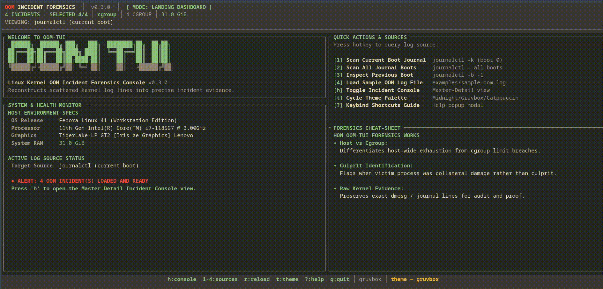

<div align="center">

# OOM-TUI

[](https://github.com/Ashfaaq98/oom-tui/actions/workflows/ci.yml)
[](https://github.com/Ashfaaq98/oom-tui/releases)
[](LICENSE)
[](#development)
[](#requirements)

**A terminal forensics console for Linux OOM kills.**  
Reconstructs scattered kernel log lines into structured, navigable incidents with the original evidence preserved alongside the analysis.



</div>

It helps answer three questions quickly:

1. **What happened**: which process was killed and how much memory it used.
2. **Why**: whether the kernel reported host-wide pressure or a cgroup limit.
3. **What proves it**: the untouched kernel evidence beside the analysis.

It is a forensics viewer for existing logs, not a memory monitor, daemon, or
root-cause oracle. Missing kernel data stays missing rather than guessed.

## Features

- **Landing Dashboard**: system specs, log source health status, and quick-action hotkeys at a glance
- **Master-Detail Console**: numbered incident list, structured investigation, and raw kernel evidence side-by-side with focused-pane highlighting
- **Forensic Parser**: handles global OOM kills, memory-cgroup kills, and `oom_kill_allocating_task` reports
- **Kubernetes & Container Awareness**: decodes cgroup paths into pod, container, QoS class, and runtime (Docker, Podman, systemd)
- **Multiple Log Sources**: journalctl (any boot), dmesg, syslog, files, or stdin pipe
- **Three Themes**: Midnight, Gruvbox, and Catppuccin color palettes
- **Structured Output**: JSON, JSONL, and table formats for scripting and CI pipelines
- **Zero Runtime Dependencies**: single static binary, no daemons or background processes

## Install

On Linux `x86_64` and `aarch64`, install the latest verified release into
`~/.local/bin`:

```bash
curl -fsSL https://github.com/Ashfaaq98/oom-tui/releases/latest/download/install.sh | sh
oom-tui --version
```

Ensure `~/.local/bin` is on your `PATH`. For system installs, updates,
uninstalling, a specific version, checksum verification, or building from
source, see the [installation guide](docs/installation.md).

## Quick start

Open OOM incidents from the current boot's kernel journal:

```bash
oom-tui
```

Try the bundled example:

```bash
oom-tui --file examples/sample-oom.log
```

Once inside, press `1`–`4` to scan different log sources directly from the
landing dashboard. Press `h` to toggle between the dashboard and the incident
console, `Tab` to cycle pane focus, arrow keys to select or scroll, `t` to
cycle themes, and `?` for the full keyboard reference.

## Common usage

```bash
# Inspect the boot before a reboot
oom-tui --boot -1

# Read an exported log or piped journal
oom-tui --file customer-dmesg.txt
journalctl -k | oom-tui --file -

# Use structured output in a script
oom-tui --format json | jq -r '.[] | select(.scope == "cgroup") | .victim_name'
```

| Option | Purpose |
| --- | --- |
| `-f`, `--file <FILE>` | Read a file; use `-` for stdin. |
| `-b`, `--boot <N>` | Inspect boot `0` (current), `-1` (previous), and so on. |
| `--all-boots` | Search every retained journal boot. |
| `--since <TIME>` / `--until <TIME>` | Restrict a journal time range. |
| `--format <FMT>` | Choose `tui`, `table`, `json`, or `jsonl`. |
| `--exit-code` | Exit `1` if one or more OOM events are found. |

Run `oom-tui --help` for the complete CLI reference.

## How it works

```
Kernel log -> Parser (regex state machine) -> OomEvent model -> Analysis & Diagnosis -> TUI or structured output
```

The parser reads kernel log text from any supported source (journalctl, dmesg,
syslog files, or stdin), extracts OOM kill sequences using a regex-driven state
machine, and builds structured `OomEvent` records. Each event captures the
victim process, memory stats, cgroup context, and the raw kernel lines as
evidence. The analysis layer then classifies events as host-wide or
cgroup-scoped, identifies collateral kills, and generates a human-readable
diagnosis, all rendered in an interactive [ratatui](https://ratatui.rs)-powered
terminal UI.

## Requirements

Linux is required. By default, `oom-tui` reads the first usable source in this
order: `journalctl`, `dmesg -T`, `dmesg`, `/var/log/syslog`, then
`/var/log/messages`. A supplied file or stdin takes precedence. You may need
permission to read the kernel journal, such as membership of `systemd-journal`
or `sudo`.

The parser supports global OOM kills, memory-cgroup OOM kills, and
`oom_kill_allocating_task` reports. JSON field names are stable within a major
version.

## Development

The minimum supported Rust version is 1.75. Built with
[ratatui](https://ratatui.rs) for the terminal UI.

```bash
git clone https://github.com/Ashfaaq98/oom-tui
cd oom-tui
cargo run -- --file examples/sample-oom.log
cargo fmt --all --check
cargo clippy --all-targets --all-features -- -D warnings
cargo test --all-features
```

See [CONTRIBUTING.md](CONTRIBUTING.md) for parser fixtures, conventions, and
fuzzing. Misparsed real-world logs are valuable: please [open an
issue](https://github.com/Ashfaaq98/oom-tui/issues/new/choose) with relevant,
redacted kernel lines.

## License

[MIT](LICENSE)
